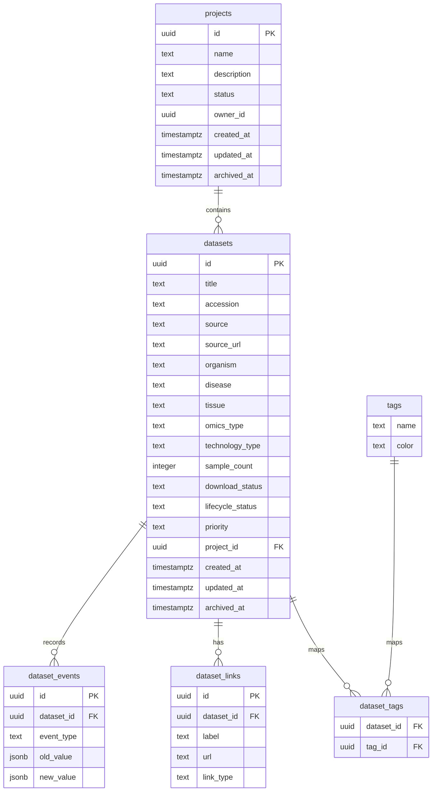

# Dataset Atlas 数据库原型设计

## 1. 设计原则

本数据库面向 Supabase/PostgreSQL，采用“轻量规范化”的关系模型。MVP 服务个人使用，但从第一版开始保留协作扩展字段，避免后续加入登录、权限和多人协作时大规模重构。

核心原则：

- 数据集是主实体，其他实体围绕数据集组织
- 项目、标签与数据集解耦，便于复用
- 删除优先使用归档字段，不直接物理删除
- 状态字段使用受控枚举值，便于筛选和统计
- 保留 `owner_id`、`created_by`、`updated_by` 以兼容 Supabase Auth

## 2. 实体关系

## 3. 表设计

### 3.1 `datasets`

主表，用于存储数据集的核心元数据。

关键字段：

- `title`：数据集标题，必填
- `accession`：数据库登录号，如 GSE、SRP、PRJNA
- `source`：来源平台，必填
- `source_url`：原始链接
- `description`：简要描述
- `organism`：物种
- `disease`：疾病或表型
- `tissue`：组织
- `cell_type`：细胞类型
- `omics_type`：组学类型
- `technology_type`：技术类型，可为空
- `sample_count`：样本数
- `data_format`：数据格式
- `download_status`：下载状态
- `lifecycle_status`：生命周期状态
- `priority`：优先级
- `project_id`：所属项目
- `notes`：备注

约束：

- `title` 和 `source` 必填
- `sample_count` 不允许为负数

### 3.2 `projects`

用于管理研究项目或数据集集合。

字段包括项目名称、描述、状态和协作扩展字段。一个项目可以包含多个数据集。

### 3.3 `tags`

标签字典表。标签可用于标记数据集主题，例如 `tumor microenvironment`、`single-cell`、`benchmark`、`high-quality`。

### 3.4 `dataset_tags`

数据集与标签的多对多关系表。一个数据集可以有多个标签，一个标签也可以对应多个数据集。

### 3.5 `dataset_events`

事件日志表，用于记录数据集生命周期中的关键变化，例如创建、状态变更、下载完成、清洗完成、分析完成、归档等。

该表适合后续展示时间线，也便于多人协作时追踪操作历史。

### 3.6 `dataset_links`

数据集相关链接表，用于补充一个数据集可能关联的多个链接，例如：

- 原始数据库页面
- 论文链接
- metadata 下载地址
- 分析结果链接
- 外部说明文档

## 4. 状态枚举

### 4.1 下载状态 `download_status`

- `not_downloaded`：未下载
- `partial`：部分下载
- `downloaded`：已下载
- `unavailable`：无法获取

### 4.2 生命周期状态 `lifecycle_status`

- `to_evaluate`：待评估
- `usable`：可用
- `analyzing`：分析中
- `completed`：已完成
- `deprecated`：弃用
- `archived`：归档

### 4.3 优先级 `priority`

- `high`：高
- `medium`：中
- `low`：低

### 4.4 项目状态 `projects.status`

- `active`：活跃
- `paused`：暂停
- `completed`：完成
- `archived`：归档

## 5. 搜索与索引

数据库原型包含以下索引：

- 登录号索引：用于快速查找 GSE、SRP、PRJNA 等编号
- 来源、物种、疾病、组学类型索引：用于列表筛选
- 下载状态、生命周期状态、优先级索引：用于状态筛选和看板统计
- 更新时间倒序索引：用于展示最近更新
- GIN 全文索引：用于标题、登录号、描述、疾病、组织、组学类型、技术类型和备注的关键词搜索

## 6. Supabase 协作扩展建议
MVP 阶段可以先关闭登录，使用 service role 或匿名读写策略进行个人使用。正式部署到公网时，不建议长期开放匿名写入。

推荐演进路径：

1. MVP 本地或私人部署：简单读写
2. 个人账户登录：启用 Supabase Auth
3. 课题组协作：增加 profiles 和 team_members 表
4. 权限控制：基于 `owner_id`、`created_by` 和团队成员关系配置 RLS
5. 审计追踪：增强 `dataset_events`，记录关键字段变化

## 7. 后续可扩展表

后续可以加入：

- `profiles`：用户资料
- `teams`：课题组或协作团队
- `team_members`：团队成员关系
- `dataset_samples`：样本级元数据
- `import_jobs`：CSV 或自动抓取任务记录
- `external_metadata_cache`：GEO/SRA API 抓取结果缓存
- `attachments`：补充文件或对象存储引用

## 8. 文件说明

可执行 SQL 原型位于：

- `docs/database-prototype.sql`

该 SQL 可在 Supabase SQL Editor 中执行，用于创建 MVP 数据库结构。
